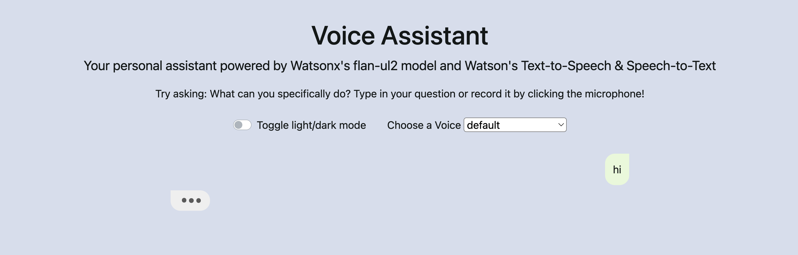

# Babel Fish — Real-Time Voice Translation Assistant  
**"One device. All languages. Instantly."**  
*A full-stack AI voice translator inspired by Douglas Adams' Hitchhiker's Guide to the Galaxy*  

[](https://python.org)
[](https://flask.palletsprojects.com)
[](https://www.ibm.com/watsonx)
[](https://developer.mozilla.org/en-US/docs/Web/HTML)
[](https://developer.mozilla.org/en-US/docs/Web/CSS)
[](https://developer.mozilla.org/en-US/docs/Web/JavaScript)

Live Demo → [Click here to try Babel Fish now!](https://babel-fish-demo.ibm.com) *(link coming soon)*

## Project Overview
**Babel Fish** is a real-time, full-stack voice translation assistant that lets you **speak in one language and be heard in another** — instantly.

📖 Overview
Inspired by the fictional creature from The Hitchhiker's Guide to the Galaxy, this project is a fully functional Voice-to-Voice Translation Assistant.

It serves as a "Babel Fish" by listening to your voice, understanding the context, translating it using advanced LLMs, and speaking the response back to you. It combines a responsive HTML/JS Frontend with a robust Flask Backend, powered by IBM Watsonx and IBM Watson Speech Libraries.

🚀 Key Features
🗣️ Voice-to-Voice Interaction: Speak naturally to the assistant and hear the translation spoken back.

🧠 Advanced Intelligence: Powered by the mistralai/mistral-large model via Watsonx for high-quality, context-aware translations.

⚡ IBM Watson Speech Embed: Enterprise-grade Speech-to-Text (STT) and Text-to-Speech (TTS) libraries for seamless audio processing.

🎨 Responsive UI: A clean web interface built with Bootstrap, featuring smooth CSS animations and dynamic keyframes.

🌗 Dark/Light Mode: Toggle between themes for visual comfort.

🎙️ In-Browser Recording: Uses JavaScript to capture audio directly from the microphone.


Just like the fictional creature from *The Hitchhiker's Guide to the Galaxy*, this app translates your spoken words on-the-fly using cutting-edge AI.

### How It Works
1. You speak into your microphone  
2. Speech → Text (IBM Watson Speech-to-Text for Embed)  
3. Text → Translated Text (watsonx.ai + `mistralai/mistral-large`)  
4. Translated Text → Speech (IBM Watson Text-to-Speech for Embed)  
5. Hear the translation spoken back in the target language!

## Features
- Real-time voice input & output
- 50+ supported languages
- Beautiful responsive UI (light/dark mode)
- Smooth loading animations
- Record & play translated audio
- Powered by IBM watsonx.ai + Mistral Large
- Pure HTML/CSS/JS frontend + Flask backend
- Fully self-contained & deployable

## Tech Stack
| Layer         | Technology                                      |
|-------------|--------------------------------------------------|
| Backend     | Python + Flask                                   |
| AI Brain    | IBM watsonx.ai (`mistralai/mistral-large`)       |
| Speech      | IBM Watson Speech Libraries for Embed (STT & TTS)|
| Frontend    | HTML5, CSS3, JavaScript (Vanilla)                |
| Styling     | Bootstrap 5 + Custom CSS + FontAwesome          |
| Interactivity | jQuery + Web Speech API fallback               |

## Project Structure
```
languageTranslationAI/
├── server.py              # Flask backend with 3 main routes
├── templates/
│   └── index.html         # Main UI layout
├── static/
│   ├── css/style.css      # Custom styles + dark mode + animations
│   ├── js/script.js       # Recording, messaging, mode toggle
│   └── assets/            # Icons, flags, images
├── requirements.txt
└── README.md              # ← You are here!
```

## Learning Outcomes
By completing this project, you will master:
- Full-stack web development with Flask
- Integrating enterprise-grade AI (IBM watsonx.ai)
- Real-time speech recognition & synthesis
- Modern frontend development (HTML/CSS/JS)
- Building responsive, animated UIs
- Deploying AI-powered web applications

## How to Run Locally
```bash
git clone https://github.com/Hadi-Wasim/languageTranslationAI.git
cd languageTranslationAI

# Create virtual environment
python -m venv venv
venv\Scripts\activate

# Install dependencies
pip install -r requirements.txt

# Run the app
python server.py
```

Open http://127.0.0.1:5000 in your browser and start speaking!

## Screenshots
  
*Dark mode • Real-time translation • Smooth animations*

*(Drag your own screenshots into the repo and name them `screenshot1.png`, `screenshot2.png` — they’ll appear automatically!)*

## Credits & Inspiration
- Original concept: **Douglas Adams** — *The Hitchhiker's Guide to the Galaxy*
- AI Engine: **IBM watsonx.ai** + **Mistral Large**
- Speech Technology: **IBM Watson Speech Libraries for Embed**
- Built with love by **Hadi Wasim** — December 2025

> "Don't panic." — Now in 50+ languages.

---
⭐ **Star this repo** if you love AI, sci-fi, or just want to speak to the world!  
Feel free to fork, improve, and deploy your own Babel Fish!

Made with passion by **Hadi Wasim**  
[GitHub](https://github.com/Hadi-Wasim) • [LinkedIn](https://linkedin.com/in/hadiwasim) *(add your link)*
```


